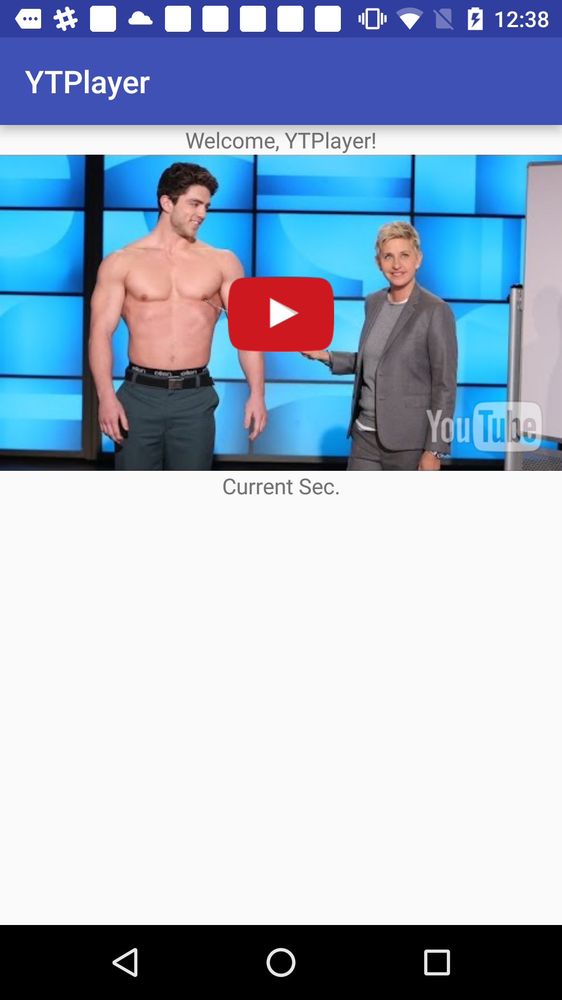
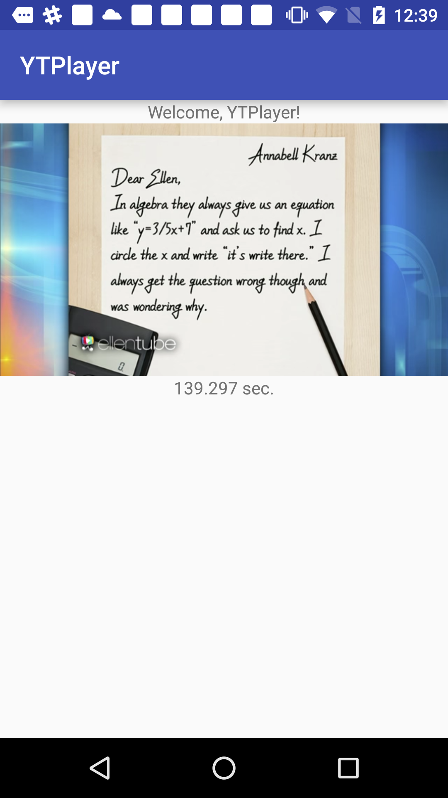

Youtube-Android-Player-Helper(YTPlayer)
=====
Helper library for Android developers looking to add YouTube video playback in their applications via the iframe player in WebView

Sample Capture
=====




Download
--------
use Gradle:

```gradle
 repositories {
  jcenter()
}

dependencies {
  compile 'com.jaedongchicken:ytplayer:1.4.4'
}
```

Or Maven:

```xml
<dependency>
  <groupId>com.jaedongchicken</groupId>
  <artifactId>ytplayer</artifactId>
  <version>1.4.4</version>
  <type>pom</type>
</dependency>
```


How do I use YTPlayer?
-------------------
You can see more detail from [MainActivity.java][1].

Simple use cases will look something like this:
* XML

```xml
    <com.jaedongchicken.ytplayer.YoutubePlayerView
        android:id="@+id/youtubePlayerView"
        android:layout_width="match_parent"
        android:layout_height="wrap_content" />

```

* JAVA

```java
        // get id from XML
        YoutubePlayerView youtubePlayerView = (YoutubePlayerView) findViewById(R.id.youtubePlayerView);
       
         // Control values
         // see more # https://developers.google.com/youtube/player_parameters?hl=en
        YTParams params = new YTParams();
        // params.setControls(0); // hide control
        // params.setVolume(100); // volume control
        // params.setPlaybackQuality(PlaybackQuality.small); // video quality control

        
         // initialize YoutubePlayerCallBackListener with Params and VideoID
        // youtubePlayerView.initialize("WCchr07kLPE", params, new YoutubePlayerView.YouTubeListener())

		// initialize YoutubePlayerCallBackListener with Params and Full Video URL
        // To Use - avoid UMG block!!!! but you'd better make own your server for your real service.
        // youtubePlayerView.initializeWithCustomURL("p1Zt47V3pPw" or "http://jaedong.net/youtube/p1Zt47V3pPw", params, new YoutubePlayerView.YouTubeListener())
        

       // make auto height of youtube. if you want to use 'wrap_content'
        youtubePlayerView.setAutoPlayerHeight(this);
        // initialize YoutubePlayerCallBackListener and VideoID
        youtubePlayerView.initialize("YOUTUBE_ID", new YoutubePlayerView.YouTubeListener() {

            @Override
            public void onReady() {
                // when player is ready.
            }

            @Override
            public void onStateChange(YoutubePlayerView.STATE state) {
                /**
                 * YoutubePlayerView.STATE
                 *
                 * UNSTARTED, ENDED, PLAYING, PAUSED, BUFFERING, CUED, NONE
                 *
                 */
            }

            @Override
            public void onPlaybackQualityChange(String arg) {
            }

            @Override
            public void onPlaybackRateChange(String arg) {
            }

            @Override
            public void onError(String error) {
            }

            @Override
            public void onApiChange(String arg) {
            }

            @Override
            public void onCurrentSecond(double second) {
                // currentTime callback
            }

            @Override
            public void onDuration(double duration) {
                // total duration
            }

            @Override
            public void logs(String log) {
                // javascript debug log. you don't need to use it.
            }
        });


        // psuse video
        youtubePlayerView.pause();
        // play video when it's ready
        youtubePlayerView.play();
        
    
    @Override
    protected void onPause() {
        super.onPause();
        // pause video when on the background mode.
        youtubePlayerView.pause();
    }
    
    @Override
    protected void onDestroy() {
        super.onDestroy();
        // this is optional but you need.
        youtubePlayerView.destroy();
    }
    
```


Updated
------
```
V 1.4.4 - Open Player when you click the logo.
V 1.4.3 - Fixed player is not to redirect.
v 1.4.2 - fix handler.
v 1.4.1 - Solved UMG block.
v 1.3.0 - added AudioVolume, VideoQualoty in YTParams class.
v 1.2.0 - added YTParams class, many youtube functions defined.
v 1.1.0 - added setWhiteBackgroundColor() method.
```

Author
------
Jaedong Kim - @JackDinealKIM on GitHub, mashiaro@gmail.com


Disclaimer
---------
This is not an official Google product.

License
-------
```code
Copyright 2016 JD Kim

Licensed under the Apache License, Version 2.0 (the "License");
you may not use this file except in compliance with the License.
You may obtain a copy of the License at

http://www.apache.org/licenses/LICENSE-2.0

Unless required by applicable law or agreed to in writing, software
distributed under the License is distributed on an "AS IS" BASIS,
WITHOUT WARRANTIES OR CONDITIONS OF ANY KIND, either express or implied.
See the License for the specific language governing permissions and
limitations under the License.
```

[1]: https://github.com/JackDinealKIM/youtube-android-player-helper/blob/master/app/src/main/java/com/jaedongchicken/ytplayer_sample/MainActivity.java


